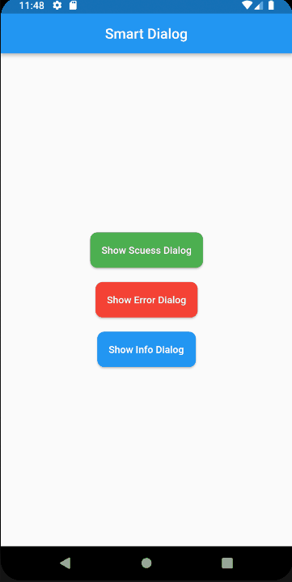

<!-- 
This README describes the package. If you publish this package to pub.dev,
this README's contents appear on the landing page for your package.

For information about how to write a good package README, see the guide for
[writing package pages](https://dart.dev/guides/libraries/writing-package-pages). 

For general information about developing packages, see the Dart guide for
[creating packages](https://dart.dev/guides/libraries/create-library-packages)
and the Flutter guide for
[developing packages and plugins](https://flutter.dev/developing-packages). 
-->

The new flutter smart and simple dialog package that is easy to understand and simple to implement

All you need is simple import library for this flutter package


```
import 'package:simple_dialogs_flutter/simple_dialogs_flutter.dart';
```

example of implementation pass some text in this dialog

```
                SimpleDialogs.showinfoDialog(context: context, title: "Something insert here");

```




In the button you need code like this
```
 MaterialButton(
              color: Colors.blue,
              height: 50,
              shape: const RoundedRectangleBorder(
                borderRadius: BorderRadius.all(Radius.circular(10)),
              ),
              textColor: Colors.white,
              child:  Text('Show Info Dialog',),
              onPressed: () {
                SimpleDialogs.showinfoDialog(context: context, title: "Something insert here");
              },
```


